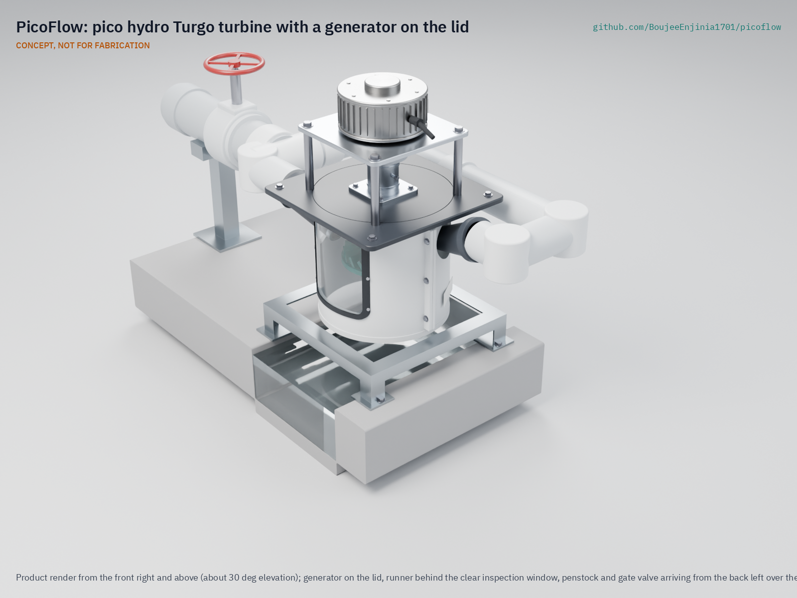

# PicoFlow

     

**Area:** CleanTech · **TRL:** 3 of 9 (proof of concept on paper) · **Value-engineering target:** about $450 USD · **Difficulty:** 3 of 5

3D-printed Turgo runner in a printed or PVC nozzle housing, driving an off-the-shelf BLDC motor used as a generator, with an MPPT dump-load controller.

[Exploded render](media/render-exploded.png) · [Detail render](media/render-detail.png) · [Interactive 3D model](media/viewer.html) · [Concept blueprint (PDF)](media/concept-blueprint.pdf) · [General arrangement (PDF)](cad/drawings/PCF-DWG-001.pdf) · [Sizing calculations](docs/04-calcs/01-sizing.md) · [Prototype build plan](docs/05-build-plan.md) · [Design decisions](docs/06-design-decisions.md) · [Review note](docs/REVIEW.md)

## Concept rationale

A Turgo runner suits the low heads and debris-laden streams that most households near water actually have. It runs in air above the tailwater, tolerates leaves and sand better than a closed propeller, and keeps its efficiency at part flow, so one runner covers 1 to 3 m of head by changing only the nozzle inserts. Putting the bearings and generator on the lid, above the spray, addresses the main reason cheap low-head units fail: bearings and windings that sit in or near the water.

The design is open and garage-buildable because the households that need it are far from spare-parts supply chains. A 200 mm runner prints on a common desktop printer in about a day, the housing and pipework are standard PVC, and the generator is an off-the-shelf low-speed motor, with a salvaged washing machine motor as the low-cost variant. A local workshop can therefore build, repair and adapt it without depending on a single supplier.

## Burning platform

About 666 million people still had no electricity in 2023, and 85 % of them live in sub-Saharan Africa ([World Bank, Tracking SDG 7: The Energy Progress Report 2025](https://www.worldbank.org/en/topic/energy/publication/tracking-sdg-7-the-energy-progress-report-2025)). Many live in hilly, well-watered areas where a stream runs past the house day and night, and pico hydro turns that flow into continuous power that solar alone cannot match after dark or in the rainy season.

The market has already shown both the demand and the failure mode. In Vietnam, 100,000 to 120,000 cheap low-head propeller units were sold over 10 to 15 years, but probably no more than 30,000 were still running, because most became unusable within 2 to 3 years as lower bearings, seals and generator windings failed ([DFID project R8150, Vietnam country report](https://assets.publishing.service.gov.uk/media/57a08cf340f0b652dd001676/R8150-Vietnam.pdf)). Households paid again and again for power that did not last.

## Where it could be used

### By industry

| Industry | Use |
| --- | --- |
| Rural energy access | Continuous battery charging for lights, phones, radio and small appliances in off-grid homes near streams |
| Agriculture | Power for fence energizers, pump controls, lighting and monitoring on farms with irrigation channels or spring outflows |
| Health and education in remote areas | A second, round-the-clock source beside solar for rural clinics and schools, strongest in the rainy season |
| Tourism and remote huts | Quiet, fuel-free power for mountain huts, lodges and cabins on a stream |
| Environmental monitoring | Local power for stream gauges, water-quality sensors and camera traps at the water's edge |
| Technical training | An inspectable turbine for teaching fluid machinery, power electronics and hydropower siting |

### By country or region

| Country or region | Why it matters there |
| --- | --- |
| Sub-Saharan Africa (for example the highlands of Rwanda, Uganda and eastern DR Congo) | Home to 85 % of the people without electricity ([World Bank, 2025](https://www.worldbank.org/en/topic/energy/publication/tracking-sdg-7-the-energy-progress-report-2025)); many highland homes sit near year-round streams |
| Vietnam (northern uplands) | A proven market for household pico hydro, where most cheap units fail in 2 to 3 years ([DFID R8150](https://assets.publishing.service.gov.uk/media/57a08cf340f0b652dd001676/R8150-Vietnam.pdf)); a durable, repairable unit fits existing habits |
| Nepal | Steep hill streams and a long-standing national program for micro and mini hydro ([AEPC](https://www.aepc.gov.np/pages/minimicro-hydro)); pico units can reach homes beyond a village scheme |
| Peru | A World Bank-supported rural electrification project installed 11,915 solar home systems in isolated areas and prepared studies for 21 small hydropower projects in the country's major basins ([World Bank, 2019](https://www.worldbank.org/en/results/2019/05/13/promoting-rural-electrification-in-peru)); a pico unit could serve scattered mountain homes on a stream beyond those schemes |
| New Zealand and the United Kingdom | High-income off-grid cabins and farms already use commercial pico turbines such as the New Zealand-made PowerSpout ([PowerSpout LH](https://www.powerspout.com/pages/low-head-lh-info)); an open design lowers the cost of a repairable, low-head alternative |

## What sparked the idea

The idea traces back to the Turgo turbine itself. In 1919 the young engineer Eric Crewdson, then a trainee at the English turbine maker Gilkes of Kendal, applied for a patent on a side-entry impulse runner that would run at twice the speed of a Pelton wheel on the same head, with jets striking one side at an angle and discharging from the other; the patent was granted in 1920 ([Gilkes, "100 Years of the Turgo Impulse Turbine"](https://www.gilkes.com/media/1809/100-yrs-of-the-turgo-impulse-rev-4.pdf)). A century on, that higher speed at low head is what lets a small runner drive an off-the-shelf motor directly, without a gearbox, and the University of Bristol's 2013 tests of a Turgo at heads from 3.5 m down to 1 m, which reached 87 % jet-to-mechanical efficiency at 1 m ([Williamson, Stark and Booker, Applied Energy 102](https://research-information.bris.ac.uk/en/publications/performance-of-a-low-head-pico-hydro-turgo-turbine)), showed the principle holds far below its usual range. PicoFlow is an attempt to put Crewdson's runner into a form that a village workshop can print and repair.

## Problem

Remote homes near streams with 1 to 3 m of head have few durable, repairable turbine options: cheap closed units wear out in two or three years, and durable ones cost several times a household budget.

## Concept

3D-printed Turgo runner in a printed or PVC nozzle housing, driving an off-the-shelf BLDC motor used as a generator, with an MPPT dump-load controller.

At 2 m of head and 10 L/s, the TRL 3 sizing calculation (PCF-CAL-001) gives about 86 W into a 12 V battery, or about 2.05 kWh a day, running around the clock, with a 125 mm penstock; pipe, valve and branch losses take about 16 % of the head. The generator sits on the lid above the spray, the dump load keeps the runner from running away when the battery is full, and a hardware clamp holds the DC side below 48 V if the controller fails.

Full design precis: [docs/02-concept.md](docs/02-concept.md)

## Key components

- Printed Turgo runner, 200 mm (PETG prototype, glass-filled nylon for field units), with two opposed 34 mm jets from printed nozzles bolted to the housing
- New low-speed 500 W BLDC motor as generator (a salvaged washing machine motor is the low-cost variant)
- Two sealed flange bearing units above the spray on a stainless shaft
- 125 mm PVC penstock with a slow-closing, full-bore gate valve, forebay screen and 315 mm PVC housing
- Three-phase rectifier
- Open-design MPPT, dump-load and clamp controller for a 12 V battery
- 300 W dump-load resistor and 6.8 ohm, 350 W clamp resistor

The priced bill of materials is in [bom/bom.csv](bom/bom.csv): about $618 for the turbine kit with a new generator, against a value-engineering target of $450; penstock and battery excluded.

## Building the prototype

The [prototype build plan](docs/05-build-plan.md) (PCF-BLD-001) shows, in pictures, how to make each of the 23 components and put them together in nineteen steps; nothing has been built yet. The made parts are a welded steel frame, a housing cut from sewer pipe, printed nozzles, inserts and runner, a plastic lid, posts, a generator plate, pipe stands, the cut pipework, a forebay and an equipment post; the bearings, generator, fittings, valve and electrics are bought. Writing the plan made the design buildable: tie rods now clamp lid, housing and frame together, flange bearing units replace a machined housing, the nozzles bolt to the housing through gasketed saddles, and the pipework uses standard fittings on three stands (PCF-DDR-003, open for Amish's review). Every picture is drawn from the model, which checks that each part touches what it should and clears what it should not.

## Safety

> Streams and weirs can drown people; install and service only at low flow. The runner and coupling rotate; close the valve and wait for them to stop before opening the housing. With no load and a failed clamp the generator can exceed 60 V DC, so the DC side stays enclosed; the dump load and clamp resistor run hot. Close the gate valve slowly. The 12 V battery needs a BMS and a fuse at the terminal.

## Repository layout

| Folder | Contents |
| --- | --- |
| `docs/` | Problem, concept, requirements, calculations and design decisions |
| `cad/src/` | build123d Python source, the source of truth for all geometry |
| `cad/step/`, `cad/stl/` | Exported models for FreeCAD, other CAD tools and printing |
| `cad/drawings/` | 2D sketches and dimensioned drawings |
| `bom/` | Bill of materials |
| `electronics/` | KiCad schematics and PCB layouts |
| `firmware/` | Microcontroller code |
| `media/` | Renders, perspectives and photos |
| `build-log/` | Dated prototyping notes |

## Documentation

Controlled documents follow the portfolio [documentation standard](.kit/STANDARDS.md). Each carries a document ID (PCF-PRC-001 for the precis), a version and a revision history. Branded PDFs are built with `python .kit/render.py` and attached to GitHub Releases when a document is tagged, for example `PCF-PRC-001/v1.0`.

## Credits

Designed by Amish Chadha. See [CONTRIBUTORS.md](CONTRIBUTORS.md) for roles. To cite this design, use [CITATION.cff](CITATION.cff) (GitHub shows it as "Cite this repository").

AI assistance (Claude) was used to accelerate concept renders, prototype documentation and first-pass sizing calculations. Design direction and all decisions are Amish Chadha's, recorded in this repository's decision records (`docs/decisions/`).

## Licenses

- **Hardware** (CAD, drawings, BOM, electronics): [CERN-OHL-S v2](LICENSE)
- **Software** (firmware, scripts, notebooks): [MIT](LICENSE-SOFTWARE)

A project of the [Design Molecule](https://designmolecule.com) lab.
