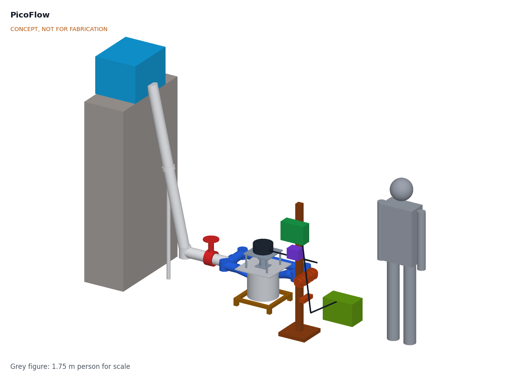

# PicoFlow

  

**Area:** CleanTech · **TRL:** 3 of 9 (proof of concept on paper) · **Prototype budget:** $450 USD · **Difficulty:** 3 of 5

3D-printed Turgo runner in a printed or PVC nozzle housing, driving an off-the-shelf BLDC motor used as a generator, with an MPPT dump-load controller.

[Interactive 3D model](media/viewer.html) · [Concept blueprint (PDF)](media/concept-blueprint.pdf) · [General arrangement (PDF)](cad/drawings/PCF-DWG-001.pdf) · [Sizing calculations](docs/04-calcs/01-sizing.md) · [Review note](docs/REVIEW.md)

## Problem

Remote homes near streams with 1 to 3 m of head have few durable, repairable turbine options: cheap closed units wear out in two or three years, and durable ones cost several times a household budget.

## Concept

3D-printed Turgo runner in a printed or PVC nozzle housing, driving an off-the-shelf BLDC motor used as a generator, with an MPPT dump-load controller.

At 2 m of head and 10 L/s, the TRL 3 sizing calculation (PCF-CAL-001) gives about 77 W into a 12 V battery, or about 1.85 kWh a day, running around the clock; pipe losses of about 24 % keep it just under the 80 W target, and a 125 mm penstock would recover it. The generator sits on the lid above the spray, the dump load keeps the runner from running away when the battery is full, and a hardware clamp holds the DC side below 48 V if the controller fails.

Full design precis: [docs/02-concept.md](docs/02-concept.md)

## Key components

- Printed Turgo runner, 200 mm (PETG prototype, glass-filled nylon for field units), with two opposed 34 mm jets
- New low-speed 500 W BLDC motor as generator (a salvaged washing machine motor is the low-cost variant)
- Sealed bearings above the spray on a stainless shaft
- PVC penstock with a slow-closing gate valve, forebay screen and 315 mm PVC housing
- Three-phase rectifier
- Open-design MPPT, dump-load and clamp controller for a 12 V battery
- 300 W dump-load resistor and 8.2 ohm clamp resistor

The priced bill of materials is in [bom/bom.csv](bom/bom.csv): $448 for the turbine kit with a new generator, penstock and battery excluded.

## Safety

> Streams and weirs can drown people; install and service only at low flow. The runner and coupling rotate; close the valve and wait for them to stop before opening the housing. With no load and a failed clamp the generator can exceed 60 V DC, so the DC side stays enclosed; the dump load and clamp resistor run hot. Close the gate valve slowly. The 12 V battery needs a BMS and a fuse at the terminal.

## Repository layout

| Folder | Contents |
| --- | --- |
| `docs/` | Problem, concept, requirements, calculations and design decisions |
| `cad/src/` | build123d Python source, the source of truth for all geometry |
| `cad/step/`, `cad/stl/` | Exported models for FreeCAD, other CAD tools and printing |
| `cad/drawings/` | 2D sketches and dimensioned drawings |
| `bom/` | Bill of materials |
| `electronics/` | KiCad schematics and PCB layouts |
| `firmware/` | Microcontroller code |
| `media/` | Renders, perspectives and photos |
| `build-log/` | Dated prototyping notes |

## Documentation

Controlled documents follow the portfolio [documentation standard](.kit/STANDARDS.md). Each carries a document ID (PCF-PRC-001 for the precis), a version and a revision history. Branded PDFs are built with `python .kit/render.py` and attached to GitHub Releases when a document is tagged, for example `PCF-PRC-001/v1.0`.

## Licenses

- **Hardware** (CAD, drawings, BOM, electronics): [CERN-OHL-S v2](LICENSE)
- **Software** (firmware, scripts, notebooks): [MIT](LICENSE-SOFTWARE)

Part of the open hardware portfolio at [amishchadha.com](https://amishchadha.com).
