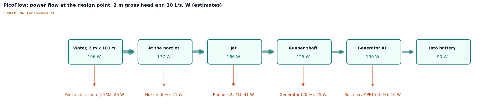
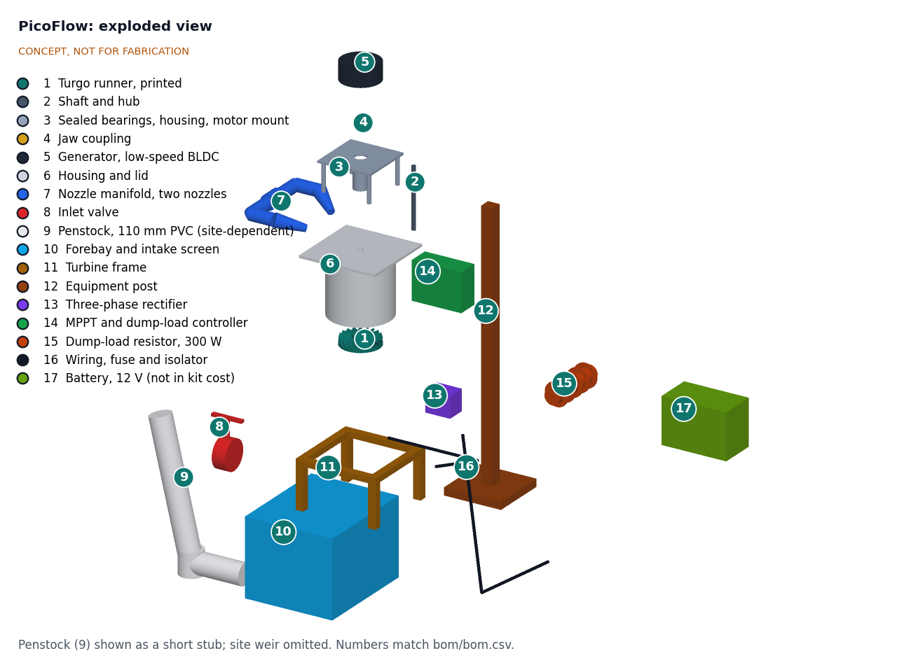
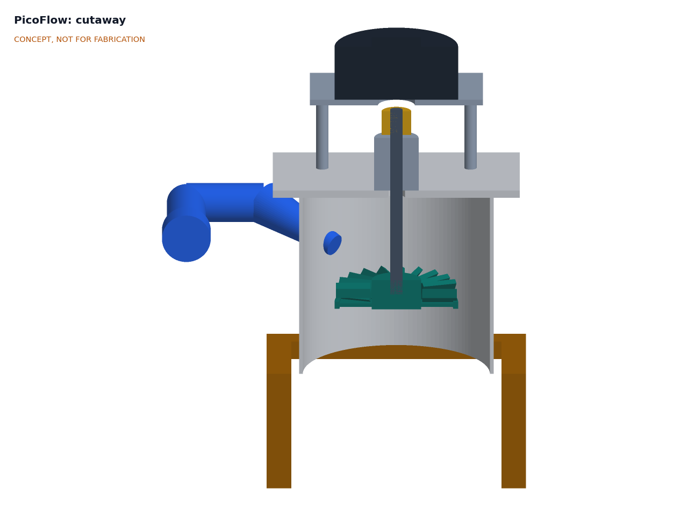

# PicoFlow design precis

PicoFlow is a vertical-shaft pico hydro turbine for 1 to 3 m of head: water from a small forebay runs down a PVC penstock to two printed nozzles, which drive a 200 mm 3D-printed Turgo runner inside an open-bottomed PVC housing. The runner turns a low-speed BLDC motor, used as a generator, that sits on the lid above the spray, and an MPPT controller charges a 12 V battery and diverts surplus power to a dump-load resistor. First-order numbers suggest about 90 W into the battery at 2 m and 10 L/s (about 2.2 kWh a day), about 30 W at 1 m and about 165 W at 3 m. The turbine kit costs about $424 in parts with a new generator (21 % over the $350 budget) or about $354 with a salvaged washing machine motor, with the penstock and battery excluded.

*Figure 1. PicoFlow at a 2.2 m weir or rock step, with a 1.75 m person for scale. The penstock is drawn short; real sites typically need 10 to 30 m of pipe. Kit parts are colored; the site is grey.*

## How it works

1. **Intake.** A small forebay (a plastic tub or masonry box) at the top of the drop settles sand and passes water through a 6 mm screen. Surplus water spills over the forebay and carries leaves away, so the screen cleans itself.
2. **Penstock.** A 110 mm PVC pipe carries about 10 L/s down 1 to 3 m of head. At these heads the static pressure is at most about 30 kPa (4.3 psi), so low-cost non-pressure drainage pipe can be used (proposed, to confirm at TRL 3). A valve at the bottom starts and stops the turbine.
3. **Nozzles.** A tee splits the flow into two 63 mm branches, each ending in a printed nozzle with a swappable insert (20 to 45 mm bore) matched to the site's head and flow. The jets strike the runner from above at about 20 degrees to the runner plane.
4. **Runner.** A printed Turgo runner, 200 mm outside diameter and about 150 mm pitch diameter, with 20 buckets, turns at about 340 rpm at the design point. The water leaves the far side of the buckets and falls straight out of the open bottom of the housing into the tailrace, so nothing floods the runner.
5. **Shaft and bearings.** A 20 mm stainless shaft runs up through the lid into a housing with two sealed ball bearings, above the spray, and drives the generator through a jaw coupling.
6. **Generator.** A low-speed BLDC motor (about 500 W rated, about 10 rpm per volt) produces three-phase AC at about 28 V under load.
7. **Power electronics.** A three-phase bridge rectifies the output. The controller runs a buck converter that holds the generator at the voltage giving the runner its best speed (maximum power point tracking, MPPT) and charges the 12 V battery. When the battery is full, or if it is disconnected, the controller switches the output into a 300 W dump-load resistor so the runner never runs unloaded. The dump load can heat water or air instead of wasting the energy.

*Figure 2. Power flow at the design point (2.0 m gross head, 10 L/s). All values are estimates.*

## Main components

Numbers match the exploded view (Figure 3) and `bom/bom.csv`.

| # | Component | Proposed choice | Notes |
| --- | --- | --- | --- |
| 1 | Turgo runner | 200 mm OD, 150 mm pitch diameter, 20 buckets, printed in PETG (prototype) or glass-filled nylon | Fits a 220 x 220 mm bed; material proposed, awaiting Amish |
| 2 | Shaft and hub | 20 mm 316 stainless shaft, keyed hub clamped in the runner | |
| 3 | Bearings, bearing housing, motor mount | Two 6204-2RS sealed bearings in a housing on the lid; four posts carry the generator plate | Bearings above the spray (R11) |
| 4 | Coupling | Jaw coupling with elastomer spider | Takes up misalignment between shaft and generator |
| 5 | Generator | Low-speed BLDC, about 500 W rated, about 10 rpm/V; new unit or salvaged direct-drive washing machine motor | Proposed, awaiting Amish |
| 6 | Housing and lid | 315 mm PVC sewer pipe section, 300 mm tall, open bottom; 400 x 400 mm HDPE or marine plywood lid | |
| 7 | Nozzle manifold and nozzles | 110 x 63 mm tee, 63 mm branches, two printed nozzles with swappable inserts | Inserts 20 to 45 mm (R2, R10) |
| 8 | Inlet valve | 90 mm (3 in) PVC ball or butterfly valve | Close slowly (see Safety) |
| 9 | Penstock | 110 mm PVC, about 20 m, with a support every 2 to 3 m | Site-dependent; excluded from kit cost |
| 10 | Forebay and intake screen | Plastic tub or masonry box, 6 mm stainless mesh, overflow lip | |
| 11 | Turbine frame | Galvanized steel angle or treated timber, bolted to a pad over the tailrace | Must be lowered (R13) |
| 12 | Equipment post | Treated timber post on a base plate | Keeps electronics out of spray and flood |
| 13 | Rectifier | Three-phase bridge, 35 A, 1,000 V, on a heat sink | |
| 14 | MPPT and dump-load controller | Microcontroller, synchronous buck converter, MOSFET dump-load switch, voltage clamp | Open design or off-the-shelf; proposed, awaiting Amish |
| 15 | Dump-load resistor | 300 W, 12 V heating element or wire-wound resistor in a vented guard | About 1.5 times the highest expected output |
| 16 | Wiring, fuse and isolator | 4 mm² cable, 20 A fuse at the battery, DC isolator, cable glands | |
| 17 | Battery | 12 V, about 50 Ah LiFePO4 with BMS (or an existing lead-acid battery) | Household item; excluded from kit cost |

*Figure 3. Exploded view with numbered callouts matching the BOM. The penstock is shown as a short stub and the site weir is omitted.*

*Figure 4. Cutaway of the turbine unit: nozzle, runner inside the open-bottomed housing, shaft, bearing housing, coupling and generator above the lid.*

## First-order numbers

All values are estimates for concept review and will be checked at TRL 3. Symbols: ρ = 1,000 kg/m³, g = 9.81 m/s².

### Design point: 2.0 m gross head, 10 L/s

Assumptions: penstock loss 10 % of gross head (110 mm PVC, 20 m, about 1.2 m/s pipe velocity), nozzle velocity coefficient 0.97, runner efficiency 75 % (a first printed design; optimized laboratory runners reach 87 to 91 % ([Williamson, Stark and Booker, 2013](https://research-information.bris.ac.uk/en/publications/performance-of-a-low-head-pico-hydro-turgo-turbine))), generator 80 %, rectifier and MPPT converter 90 %.

| Quantity | Estimate | Basis |
| --- | --- | --- |
| Gross hydraulic power | about 196 W | ρ g Q H = 1,000 x 9.81 x 0.010 x 2.0 |
| Net head at the nozzles | about 1.8 m | 2.0 m less 10 % friction |
| Jet velocity | about 5.8 m/s | 0.97 x √(2 g x 1.8) |
| Jet power | about 166 W | ½ ρ Q v² |
| Jet diameter, two jets | about 33 mm each | Q/2 over v gives 8.7 cm² per jet |
| Jet to pitch diameter ratio | about 0.22 | 33 / 150 mm; the PowerSpout DIY rotor runs up to about 0.28 (25 mm jet on 90 mm running diameter) ([PowerSpout](https://www.powerspout.com/products/diy-turgo-rotor)) |
| Best runner speed | about 340 rpm | Bucket speed about 0.46 of jet speed, 2.65 m/s on a 150 mm pitch circle |
| Shaft power and torque | about 125 W, about 3.5 N·m | 166 W x 0.75; at 35 rad/s |
| Generator output | about 100 W at about 28 V DC | x 0.80; about 34 V open circuit at 10 rpm/V |
| **Into the battery** | **about 90 W, about 6.6 A at 13.6 V** | x 0.90 |
| Water-to-wire efficiency | about 46 % | 90 / 196 W (R5) |
| Daily energy | about 2.2 kWh | 90 W x 24 h (R6); about the daily yield of 500 to 650 W of solar panels at 4.5 peak sun hours and 75 % system efficiency |

### Across the head range

With the design-point nozzles, flow rises and falls with the square root of head. Nozzle inserts can be changed to use more or less of the stream.

| Gross head | Flow, same nozzles | Best speed | Open-circuit DC at best speed | Into battery (about 46 %, lower at 1 m) | Requirement |
| --- | --- | --- | --- | --- | --- |
| 1.0 m | about 7.1 L/s | about 240 rpm | about 24 V | about 30 W | R4 (30 W) at risk |
| 2.0 m | 10 L/s | about 340 rpm | about 34 V | about 90 W | R3 (80 W) met |
| 3.0 m | about 12.2 L/s | about 410 rpm | about 41 V | about 165 W | |

A 12 V battery can be charged across the whole range with a buck converter, because the generator voltage stays above battery voltage even at 1 m. A 24 V battery would need a buck-boost converter to charge at 1 m.

### Runaway and voltage

If the load is lost and the dump load fails, an impulse runner speeds up to roughly 1.8 to 2 times its best speed. At 3.0 m head that is about 750 to 830 rpm, giving an estimated 75 to 83 V DC open circuit. That exceeds the 60 V DC level commonly treated as the limit for extra-low voltage touch safety, so R8 is not met by this concept as drawn. The fix is a hardware voltage clamp that switches the dump load in independently of the microcontroller, plus a DC side rated and enclosed for 100 V. The runner's rim speed at runaway is only about 9 m/s, so the printed runner is not expected to burst, but creep of PETG at 40 °C under continuous load is unverified.

### Loads, mass and life

- **Jet force** on the runner is about 50 N in total at the design point, and the runner weighs about 0.5 kg, so bearing loads are small; 6204 bearings carry far more. Bearing life will be set by seal wear and water ingress, not load (R12).
- **Mass:** generator about 7 kg, housing and lid about 5 kg, frame about 5 kg, bearings, shaft, coupling and runner about 3 kg: about 20 kg for the turbine unit (R14 met, estimate).
- **Setting height:** the massing model puts the nozzles 0.44 m above the tailrace floor. Every meter below the jet is lost head, which at a 2.44 m site is about 18 % (R13 not met). The frame should be lowered to about 0.3 m at TRL 3.

### Cost

| Group | Indicative cost | Requirement |
| --- | --- | --- |
| Turbine kit with a new generator (items 1 to 8, 10 to 16) | about $424 | R15 ($350) not met, about 21 % over |
| Turbine kit with a salvaged washing machine motor | about $354 | About at budget |
| Penstock, 20 m (item 9, excluded) | about $100 | Site-dependent |
| Battery, 12 V 50 Ah LiFePO4 (item 17, excluded) | about $160 | Often already owned |

For comparison, cheap low-head propeller units sold in Vietnam cost $20 to $90, but most last only 2 to 3 years ([DFID R8150](https://assets.publishing.service.gov.uk/media/57a08cf340f0b652dd001676/R8150-Vietnam.pdf)). PicoFlow's case rests on durability, repair and output per dollar over several years, not on first cost.

## Key design choices

Every choice below is **Proposed, awaiting Amish**.

- **Turgo rather than propeller at 1 to 3 m.** A propeller turbine suits low head and high flow (for example 14 to 55 L/s for the PowerSpout LH ([PowerSpout](https://www.powerspout.com/pages/low-head-lh-info))), but it runs submerged with a draft tube, and its bearings and seals sit in water. A Turgo is an impulse machine: it runs in air, tolerates debris, keeps its efficiency at part flow, and has been shown to reach 87 % at 1 m in the lab. Its limit is flow: at 1 m it needs large jets, so it suits streams of about 5 to 15 L/s rather than the larger flows a propeller uses. Recommendation: Turgo, as in the pitch. Proposed, awaiting Amish.
- **Vertical shaft with the generator on the lid.** Water falls straight out of the housing and the bearings and generator stay above the spray. A horizontal shaft is easier to couple to some motors but puts a seal in the spray path. Recommendation: vertical. Proposed, awaiting Amish.
- **Two jets.** Two 33 mm jets keep the jet-to-runner ratio near 0.22 on a printable 200 mm runner; one jet would need about 47 mm, a ratio of about 0.31. Recommendation: two jets, with the option to close one in the dry season. Proposed, awaiting Amish.
- **Generator.** Option A: a new low-speed BLDC with an output shaft (about $110, repeatable, known constants). Option B: a salvaged direct-drive washing machine motor, the type PowerSpout's rotor is built to fit (about $30 to $50, cheaper, but varies by model). Option C: an e-bike direct-drive hub motor with the runner on the disc-brake flange (no separate bearings, but the hub's seals face the spray). Recommendation: A for the prototype, with a mount that also accepts B as the low-cost variant. Proposed, awaiting Amish.
- **Runner material.** PETG for the first prototype (easy to print, adequate water resistance); glass-filled nylon for field units (stiffer and tougher, as used for the PowerSpout DIY rotor, but absorbs water and needs an enclosure to print). Proposed, awaiting Amish.
- **Battery voltage.** 12 V charges across the whole head range with a simple buck converter and matches most household batteries; 24 V halves cable current but needs buck-boost at 1 m. Recommendation: 12 V. Proposed, awaiting Amish.
- **Controller.** Option A: an open-design MPPT and dump-load board (fits the pitch, most learning, most risk). Option B: an off-the-shelf wind or hydro diversion charge controller (about the same cost, proven, but closed and without true MPPT). Recommendation: B for the first bench tests and A as the TRL 3 design, keeping the pitch. Proposed, awaiting Amish.
- **Non-pressure drainage pipe for the penstock.** Cheaper than pressure pipe at 30 kPa static head, but water hammer from a fast valve closure could exceed its rating. Recommendation: allow it only with a slow-closing valve and a surge check at TRL 3. Proposed, awaiting Amish.
- **Budget.** The kit is about $424 with a new generator. Options are in `docs/REVIEW.md`. The `project.yaml` budget is unchanged. Proposed, awaiting Amish.

## Safety

> **Safety:** PicoFlow combines moving water at a weir, a spinning runner, a generator that can exceed 60 V DC, a dump load that runs hot, and a lithium battery. Treat each as a hazard at every stage, including site survey.

- **Water and the site.** Weirs, rock steps and streams in flood can drown people, especially children. Install and service only at low flow, never stand on a weir crest, keep the intake and tailrace fenced or covered where children play, and site the turbine above normal flood level. Close the intake before entering the stream.
- **Rotating parts.** The runner is enclosed in the housing, but the coupling and shaft between the lid and the generator are exposed in the massing model. A guard around the coupling is needed. Always close the valve and wait for the runner to stop before opening the housing; a runner turning at 340 rpm can still cut fingers.
- **Runaway voltage.** With no load, the generator can reach an estimated 75 to 83 V DC at 3 m head, above the extra-low voltage touch limit. The DC side must be enclosed and rated for at least 100 V, and a hardware clamp must switch in the dump load if the controller fails (R8).
- **Dump load heat.** A 300 W resistor can exceed 200 °C in still air. Mount it in a vented metal guard, away from timber, dry grass and roofs, or immerse it in a water tank with a thermal cut-out.
- **Lithium battery.** A LiFePO4 battery is less prone to thermal runaway than other lithium chemistries but can still deliver hundreds of amperes into a short circuit. Use a battery with a BMS, a 20 A fuse within 300 mm of the battery terminal, charge-temperature limits from the BMS, and a dry, ventilated, non-combustible location. Lead-acid batteries vent hydrogen while charging and need ventilation.
- **Water hammer.** Closing the inlet valve quickly on a long penstock can raise pipe pressure well above static head. Close the valve over several seconds.
- **Environment and permits.** Leave enough water in the stream for fish and downstream users (R16), screen the intake, and check local water-use rules before building.

## Open questions for TRL 3

- Confirm the generator option and measure its constant (rpm per volt), resistance and losses at 240 to 410 rpm.
- Check runner efficiency for a printable bucket shape against the Bristol low-head results, and whether 20 buckets at 150 mm pitch diameter is right for 33 mm jets.
- Lower the frame to meet R13 while keeping the runner above flood tailwater.
- Design the hardware voltage clamp and choose DC-side ratings for runaway (R8).
- Check PETG and nylon creep, water uptake and erosion by sand under continuous duty (R12).
- Size penstock diameter against length for typical sites; decide whether drainage pipe is acceptable with a surge check.
- Close the cost gap or propose a budget change (R15).
- Choose the first site type, region and partner.

Concept media: [blueprint sheet](../media/concept-blueprint.pdf), [interactive 3D model](../media/viewer.html).
